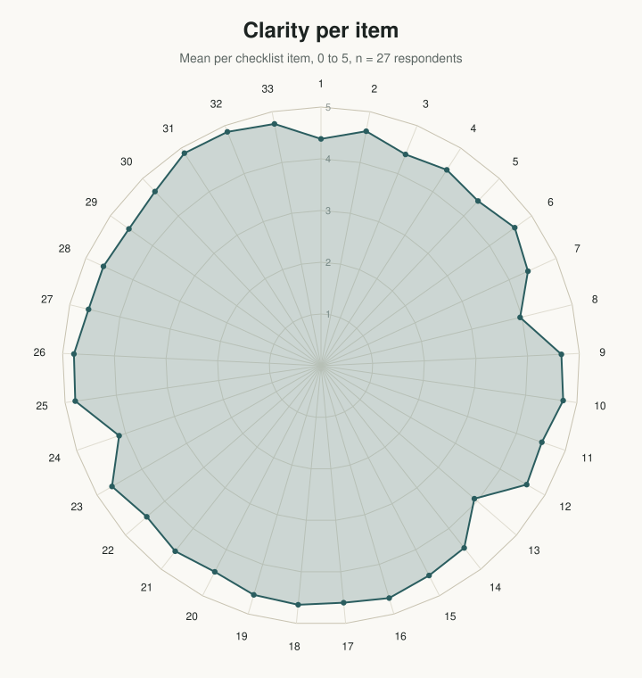
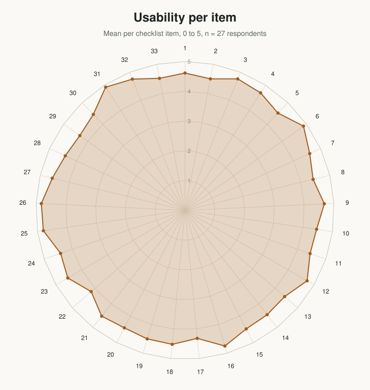

# SPIROS — Responsible Reporting

**Standardized Protocol Items Recommendations for Observational Studies**

[📋 Open the checklist](https://mauricezeegers.github.io/spiros-guideline/) · [📄 Study protocol (PDF)](https://www.maastrichtuniversity.nl/file/spiros-protocol-paperpdf) · [🔒 Data & code (private)](https://github.com/MosaROR/spiros-data) · [🏛️ Open Science Framework](https://osf.io/t6rvj/overview)

---

## About SPIROS

SPIROS (Standardized Protocol Items Recommendations for Observational Studies) is a guideline for the minimum content of an observational study protocol. We have defined the scope of the recommendations to cover three main observational study designs: cohort, case-control, and cross-sectional studies.

The SPIROS Checklist recommends a full description of what is planned; it does not prescribe how to design or conduct an observational study. By providing guidance for key content, the SPIROS recommendations aim to facilitate the drafting of high-quality observational study protocols. Adherence to SPIROS would enhance the transparency and completeness of observational study protocols for the benefit of researchers, study participants, patients, sponsors, funders, research ethics committees or institutional review boards, peer reviewers, journals, research registries, policymakers, regulators, students, and other key stakeholders.

SPIROS includes a 33-item checklist covering six main domains namely (1) general information, (2) introduction, (3) methods, (4) ethical consideration, (5) reporting and dissemination and (6) others. An associated explanatory paper (SPIROS 2026: Explanation and Elaboration) details the rationale and supporting evidence for each checklist item, along with guidance and model examples from existing protocols. We hope that the SPIROS statement will stimulate the research community to keep writing protocols of observational studies and to improve their quality and transparency.

## Resources

**[The interactive checklist](https://mauricezeegers.github.io/spiros-guideline/)** work through the 33 SPIROS items directly in your browser, expand any item for its explanation and example text, and print or export a completed copy for your protocol. Nothing you fill in is sent anywhere; progress is saved locally in your own browser only.

**[Study protocol (PDF)](https://www.maastrichtuniversity.nl/file/spiros-protocol-paperpdf)** the published SPIROS protocol paper.

**[Data & statistical code](https://github.com/MosaROR/spiros-data)** the data and analysis code underlying the SPIROS development study. This repository is private; access is available on request.

## Authors

**Raman Mahajan**
PhD Candidate, Meta-research group, Maastricht University
[More info](https://cris.maastrichtuniversity.nl/en/persons/raman-mahajan)

**Dr. Sakib Burza**
Chief Health & Innovation Officer, Health In Harmony, Honorary Associate Professor of Infectious and Tropical Diseases, London School of Hygiene and Tropical Medicine; Visiting Professor, Institute of Tropical Medicine, Nagasaki University
[More info](https://healthinharmony.org/team/sakib-burza/)

**Professor Dr. Lex Bouter**
Professor Emeritus of Methodology and Integrity, Amsterdam University Medical Centers, Department of Epidemiology and Data Science, Amsterdam Public Health Research Institute, Vrije Universiteit, Faculty of Humanities, Department of Philosophy
[More info](https://research.vu.nl/en/persons/lex-bouter)

**Professor Dr Klaas Sijtsma**
Professor of methods and techniques of psychological research; Former Rector Magnificus of Tilburg University
[More info](https://www.tilburguniversity.edu/about/history-and-academic-heritage/klaas-sijtsma)

**Professor Dr André Knottnerus**
Emeritus Professor of General Practice, Maastricht University; Former Chair, Netherlands School of Primary Care Research, Care and Public Health Research Institute (CAPHRI); Former Editor-in-chief of the Journal of Clinical Epidemiology
[More info](https://mumc.maastrichtuniversity.nl/profile/andre.knottnerus%40maastrichtuniversity.nl)

**Professor Dr Jos Kleijnen**
Emeritus Professor of Systematic Reviews in Health Care, Maastricht University
[More info](https://carim.mumc.maastrichtuniversity.nl/jos-kleijnen-professor-systematic-reviews-health-care)

**Professor Bart Staal**
Professor at HAN University of Applied Sciences, Netherlands; Senior Researcher Radboud University Medical Centre Nijmegen, Netherlands
[More info](https://www.han.nl/onderzoek/onderzoekers/bart-staal/#)

**Professor Dr Carl Lachat**
Associate Professor, Faculty of Bioscience Engineering, Ghent University
[More info](https://research.ugent.be/web/person/carl-lachat-0/en)

**Professor Joseph Ross**
Professor of Medicine (General Medicine) and of Public Health (Health Policy and Management), Yale-New Haven Hospital; Co-Director of the National Clinician Scholars program (NCSP) at Yale; Deputy Editor at JAMA
[More info](https://medicine.yale.edu/profile/joseph-ross/)

**Professor Dr Philip Greenland**
Harry W. Dingman Professor of Cardiology and Professor of Preventive Medicine, Feinberg School of Medicine, Northwestern University; Senior Editor for JAMA
[More info](https://www.feinberg.northwestern.edu/faculty-profiles/az/profile.html?xid=11644)

**Professor Dr Willi Sauerbrei**
Professor of Medical Biometry, Institute of Medical Biometry and Statistics, Medical Center, University of Freiburg, Germany; Chair of the STRATOS Initiative
[More info](https://www.ae-info.org/ae/Member/Sauerbrei_Willi)

**Ana Marušić**
Professor of Anatomy and Chair of the Department of Research in Biomedicine and Health, University of Split School of Medicine, Split, Croatia; Editor Emerita of the Journal of Global Health and the Croatian Medical Journal
[More info](https://mefst.unist.hr/research/laboratories-and-research-groups/research-group-science-and-society/ana-marusic/1718)

**Professor Gary Collins**
125th Anniversary Chair and Professor of Medical Statistics, Department of Applied Health Sciences, University of Birmingham; Director of the UK EQUATOR Centre
[More info](https://research.birmingham.ac.uk/en/persons/gary-collins/)

**Professor Dr Maurice P. Zeegers**
Professor of Complex Genetics and Epidemiology, Head of Section Meta-Research, Maastricht University
[More info](https://www.maastrichtuniversity.nl/mp-zeegers)

<!-- FEEDBACK-FIGURES:START (generated by spiros-data/feedback-analysis/update_public.py, do not edit by hand) -->
## Feedback on the checklist

Mean rating per checklist item (scale 1 to 5, axis from 0 to 5) from all 27 respondents so far: 26 in the initial pilot study (17 to 25 September 2026) and 1 since. Clarity is how clearly an item is worded; usability is how feasible it is to apply the item when writing a protocol. Mean overall usability of the checklist: 4.83 out of 5 (n=23). Feedback remains open via the [feedback form](https://mauricezeegers.github.io/spiros-guideline/feedback.html). Last updated 26 September 2026.

  
  

<!-- FEEDBACK-FIGURES:END -->

## Acknowledgements

We sincerely thank all members of the expert Delphi panel, all participants in the pilot study and everyone who has given feedback on the checklist since, who contributed their time, expertise, and thoughtful judgement to the development of the SPIROS 2026. We gratefully acknowledge the valuable contributions of the following expert panel members, pilot study participants and feedback respondents, listed alphabetically by first name: Alex Burdorf; Amani Abu-Shaheen; Amrish Baidjoe; An-Wen Chan; Ana Marusic; Anirudh Gaurang Gudlavalleti; Anne Marie Minihane; Arno Hoes; Asbjørn Hróbjartsson; Axelle Hoge; Barry D. Cookson; Bart Staal; Bismark Y. Sarfo; Caitlin Bakker; Carl Lachat; Carla Lopes; Caroline Anne Sabin; Caroline Terwee; Chiara De Waure; Christina C. Dahm; Christina van der Feltz–Cornelis; Damir Sapunar; Daniel Abera Denssa; Danielle van der Windt; Dmitry V. Nikolaenko; Dora Vukorepa; Dritan Bejko; Evan Mayo-Wilson; Femmie de Vegt; Frits Rosendaal; Hanneke van der Lee; Ian White; Jelte M. Wicherts; Jesse Berlin; Johannes H. Smit; Joseph Ross; Julian Little; Kataoka Yuki; Kelly Cobey; Klaus Linde; Lea Rahel Delfmann; Leonard Leibovici; Lionel Olivier Ouédraogo; Lisa Bero; Lisa Hartling; Malabika Sarker; Malcolm Macleod; Maria Blettner; Marjanka K. Schmidt; Marleen Boelaert; Matthew J. Page; Maureen Miller; Maurits van Tulder; Michael Von Korff; Michiel R. de Boer; Nathan Paul Ford; Nico T. Mutters; Nicole Martin; Nina Lester Finley; Nobhojit Roy; Nynke Smidt; Onno van Schayck; Patrick Bossuyt; Paul Glasziou; Paul Montgomery; Paul Shekelle; Peter Croft; Petros Isaakidis; Philip Greenland; Raffaella Ravinetto; Rajesh Kumar; Rob Herbert; Rob Scholten; Robert M. Golub, MD; Salim M. Adib; Sangeetha Shyam; Sara Schroter; Suneela Garg; Taye Letta Janfa; Wendy R. Parulekar; Willi Sauerbrei; Xiaomei Yao; Yating Chen; and seven participants who preferred to remain anonymous. We also acknowledge Peter Van Dael for his guidance during the development of the study protocol.

## Get involved

SPIROS is an active project and we welcome collaborators, on two fronts in particular. Contributions to future updates of the SPIROS guideline itself, and meta-research studying how SPIROS is being adopted and used in practice.

Interested? Open an issue in this repository, or get in touch with [Prof. Dr. Maurice Zeegers](https://www.maastrichtuniversity.nl/mp-zeegers).

---

_This repo is supported by Claude Code, commit messages are generated by Copilot. Our codebase consists of R, Python, and HTML_

